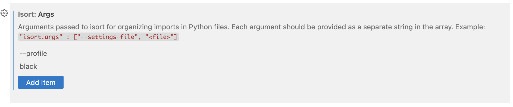

Python version : 3.11.12

---

# Requirement :

## Python environment

Create your local environment for this repo

```bash
python3.11 -m venv .venv
```

Activate it (bash/zsh)

```bash
source venv/bin/activate
```

Install requirements

```bash
python -m pip install -r requirements.txt
```

## Formating

Make sure to install and activate the extensions

- black formatter
- isort

Note that you should make sure to have the same args in your isort and black formatter settings as in the `pre-commit-config.yaml` file



Then, once venv is activated, make sure to install pre-commit with

```bash
pre-commit install
```

And voilà. Now everytime you try to commit it will reformat the files if you are not respecting the formatting of blackformatter and isort. But as you have the extensions on, everything should be fine.
